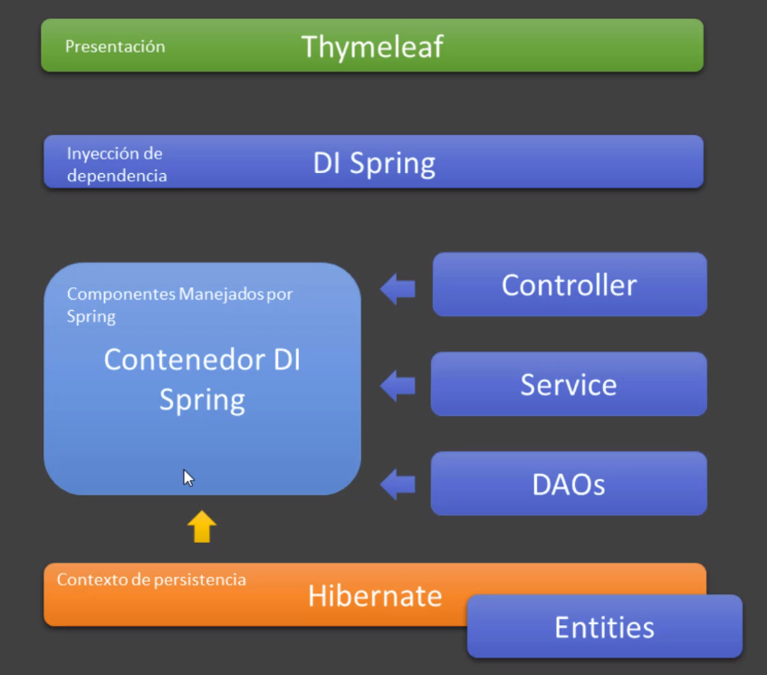

# Introduccion
- JDK para escribit codigo, JRE para ejecutar
- Spring boot, cero configuracion, trae un tomcat envevido

# Instalacion

## JDK
https://jdk.java.net/17/

<br />
Movemos la carpeta a algun lugar y configuramos los env<br />
```sh
export JAVA_HOME='/usr/local/jdk-17.0.2'
export PATH=${JAVA_HOME=}/bin:${PATH}
```

## Eclipse
Instalamos un eclipse de spring, que ya viene con todo<br />
https://spring.io/tools <br />
Viene con maven instalado

# Project
- new spring project
- dependencias:  web - spring web
- templates - thymelaf
- developer - spring boot devtools

Si marca algun error por las dependencias, deberiamos borrar el folder .m2 (maven) en el root del user.< br/>
Luego actualizamos en el proyecto (maven - Update project)<br />

Para importar: import - exists maven project

# Spring Boot

## Main
El main corre en SpringBootWebApplication.java
```java
package com.bolsadeideas.springboot.web.app;

import org.springframework.boot.SpringApplication;
import org.springframework.boot.autoconfigure.SpringBootApplication;

@SpringBootApplication
public class SpringBootWebApplication {

	public static void main(String[] args) {
		SpringApplication.run(SpringBootWebApplication.class, args);
	}

}
```

## Resource
Tenemos la configuracion principal de spring, podemos cambiar todo lo que viene por defecto<br />
application.properties
```java
//cambiar el puerto, tener cuidado de no poner espacios en blanco
server.port=8090
```

## Controller
Cada controlador debe llevar el nombre **Controller**, ejemplo **HomeController**

## Ejecucion
Run As - Spring Boot App
<br />
Una vez que esta levantada, no volvemos volver a levantarla, solo debemos reiniciar

## Deploy
vamos a la terminal y ejecutamos el comando del archivo mvnw<br />
Acordarse de configurar JAVA_HOME
```sh
./mvnw package # generamos nuetro proyecto

# corremos el jar
java -jar ./target/spring-boot-web-1-0.0.1-SNAPSHOT.jar
```

# Maven
Nos ayuda a descargar las dependencias, con el archivo **pom.xml**<br />

# Servicios
Cuando trabajamos con aplicaciones web, las capas como Service, Controller, Repository, etc.. Siempre es
mejor manejarlas con inyeccion de dependencias, nunca usar el **new**<br />


## Beans
Nos permite crear y manejar objetos en el contenedor de spring, registrarlos en el contenedor

## Scope

### Singletor
Hay una instancia en toda la aplicacion. Controller, Service, Repository son singletor, no deberian manejar estados, como por ejemplo usuario, otro usuario podria modificar el valor.


### Request
@RequestScope va a durar lo que dura una peticion HTTP

### Session
@SessionScope cuando trabajamos con sessiones, se destruye cuando cerremos el navegador

### Application
Muy parecido al Singletor pero se guarda en el application context de string, en una aplicacion podriamos tener mas de un application context (no es singletor), lo normal es usar un serverless context por defecto

## Serializable
Cualquier objeto que queramos guardar en una clase HTTP debe implementar Serializable, cuando se transporta se guardan en un contexto de persistencia, convierte el objeto en una secuencia de bytes, y luego se va a restaurar en un objeto de java

```java
public class Factura implements Serializable{

	// identificador de la serializacion, lo maneja por debajo
	private static final long serialVersionUID = 946004357128146951L;

}

```